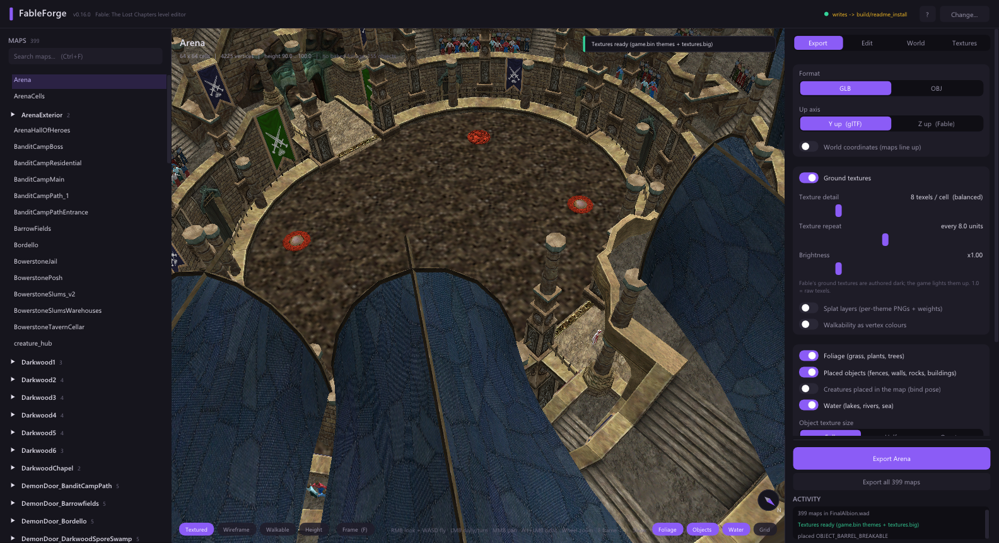
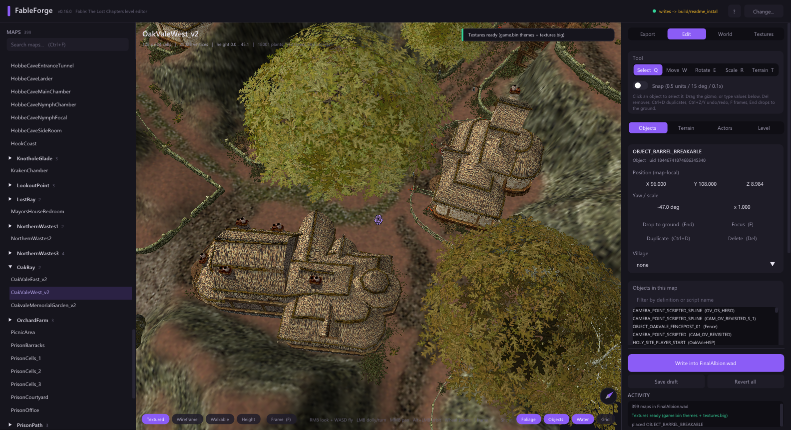
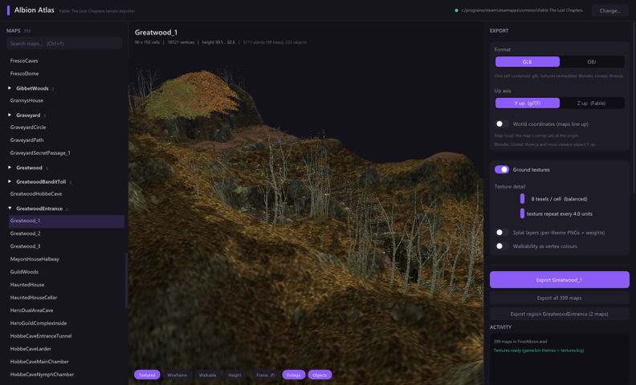

# Albion Atlas

View, export and edit **Fable: The Lost Chapters** maps — terrain, ground textures,
grass, trees, water and placed objects — straight from your Steam install. Export to
`.glb` (glTF binary) or `.obj`, or move, add and remove the objects of a level and
write the result back into the game. Two small Windows executables, no dependencies:

* **`AlbionAtlasGUI.exe`** — pick your install, browse the 399 maps on the left,
  see the map in 3D in the middle, export or edit on the right. Drag a `.lev`
  onto the window to open a loose file. Export one map or all of them.
* **`AlbionAtlas.exe`** — the same exporter as a command line tool.

Runs on anything with Direct3D 10-class graphics (falls back to the software
rasterizer if it has to).





```
AlbionAtlas list                             # every map in FinalAlbion.wad
AlbionAtlas info   Greatwood_1               # size, height range, ground themes
AlbionAtlas export Greatwood_1               # -> Greatwood_1.glb, textured
AlbionAtlas export Oakvale_1 --out oak.obj   # OBJ + MTL + PNG instead
AlbionAtlas export my_edited.lev --no-textures
AlbionAtlas effects BRAZIERFIREFINAL         # what a particle effect is made of
```

## What you get

| Layer | Source | In the file |
|---|---|---|
| Heightmap mesh | `.lev` cell grid — one vertex per world unit, height = raw × 2048 | `POSITION` / `NORMAL` / `TEXCOORD_0`, two triangles per cell, Y-up (or `--up z`) |
| Ground texture | the engine's own texture passes from `FinalAlbion_RT.stb` (per 16x16 patch: texture id, mapping direction, per-vertex blend), composited with the engine's direction weights; loose `.lev` files without an STB entry fall back to the LEV 3-theme blend → `ENGINE_THEME` defs → `textures.big` | `baseColorTexture` on a rough, non-metallic material |
| Splat layers (`--layers`) | same, unbaked | `_THEME_INDEX` / `_THEME_WEIGHT` vertex attributes, one PNG per theme in `<name>_themes/`, and `<name>.themes.json` |
| Walkability (`--walkable-colors`) | `.lev` walkable byte | `COLOR_0`: white = walkable, red = blocked |
| Foliage (`--foliage`) | baked local-detail instances in `FinalAlbion_RT.stb` — grass, flowers, bracken, bramble, stumps **and trees** (oaks, birches...) — + LOD0 meshes from `graphics.big` + their textures | one glTF mesh per plant (leaves/trunk as separate primitives), one node per instance under a `Foliage` root; cutout (`MASK`) materials. OBJ: baked into an extra object |
| Water | LEV theme blend x `ENGINE_THEME` `WaterHeight` / `WaterType` (lakes, rivers, sea, Hook Coast ice) | `Water` child node with translucent `water` / `ice` materials; OBJ `o Water` |
| Particle effects (`--things --particles`, off by default) | `CREATEPARTICLE <fx>` mesh dummies and `PARTICLE_EMITTER_PLACEABLE` things name an entry of `data/Misc/pc/effects.big` (1,165 emitters, fully parsed) | each sprite system → a tinted crossed-quad proxy (its sprite texture, start colour, render size) named after the effect; mesh systems (sun beams, dust) → the mesh scaled to its render size; `CPSCLight` → `KHR_lights_punctual` point light. Static stand-ins — no animation |
| Placed objects (`--things`) | the map's `.tng` — fences, walls, rocks, lamps, crates, buildings, chests — resolved through their `game.bin` definition's `Graphic` model id (or `GraphicOverride`), **plus the parts a mesh spawns itself**: 3ds-Max dummies named `CREATEOBJECT <def>` / `CREATEBUILDING <def>` inside a mesh place doors, windows, weathervanes, the Arena's stands and entrances, chained cave/hall interiors (the engine's `CTCMeshAutomaticEntityCreator`) | same as foliage under a `Things` root; full orientation from `RHSetForward/Up`, `ObjectScale` honoured; children follow their parent's transform, recursively. Creatures only with `--creatures` (bind pose) |

The exporter never embeds retail data; it reads the textures from **your** install.

## Options

```
--out <path>        .glb (default, self-contained) or .obj (+ .mtl + PNG)
--install <root>    Fable TLC folder (default: auto-detect via Steam)
--no-textures       heightmap only; works without an install for loose .lev files
--foliage           add the baked grass/plants/trees as mesh instances (needs an install)
--things            add the placed objects from the map's .tng (needs an install)
--creatures         with --things: include creature meshes in bind pose
--particles         with --things: static stand-ins for particle emitters (off by default)
--no-water          leave out the water surface
--max-texture <px>  shrink object/plant textures to at most <px> per side (256 = files ~1/3 smaller)
--layers            also write splat attributes + one PNG per ground theme
--texels <n>        baked albedo texels per cell edge (default 8)
--tile <units>      world units per texture repeat (default 8 = the engine's)
--up <y|z>          y = glTF/Blender/Unreal convention (default), z = Fable native
--world             place the map at its WLD MapX/MapY so several exports line up in one scene
--origin <x,y>      explicit offset instead
--walkable-colors   COLOR_0 vertex colours
```

## Known gaps (honest list)

* **Texture tiling** — pinned from the engine: the landscape vertex shader maps
  `u = x / 8, v = y / 8` (`CEngineLandscapePatch::PositionToTextureUVTransformU/V`,
  ±0.125 per axis), so one ground texture covers 8 x 8 world units; `--tile` overrides.
* **Cliffs are the engine's** — for retail maps the albedo is composited from the STB
  foreground passes: each pass carries its mapping direction (flat, or one of four
  horizontal projections with `v = -z/8`) and per-vertex blend, weighted with
  `GetMappingDirectionBlend` (flatness from `asin(n.z)`, direction falloff from the
  horizontal normal). Loose `.lev` files without an STB entry use the older slope
  heuristic. `--layers` still exports the LEV theme splat for people building a shader.
* **Foliage frames are found by grammar, not by directory** — every LZO frame
  in the map's STB chunk that parses as a cache-group collection is used (type-1
  grass batches, type-0 single meshes incl. trees, and type-2 z-sprite batches —
  distant trees the engine draws as impostors; exported as full meshes, far-LOD
  twins of a near tree dropped). Counts per mesh are in the log.
* **Terrain brightness** — Fable's ground textures are authored dark; the engine's
  own baked background patches are equally dark (checked with `AlbionAtlas ground <map>`),
  so the in-game look comes from lighting. The export keeps raw texels; `--gain` /
  the brightness slider brighten if you want a lit look baked in.
* **Caves have no lid** — terrain is the cave floor; walls and ceilings are placed
  meshes. Every cell of every map is drawn by the engine (`AlbionAtlas coverage <map>`).
* **Placed-object orientation** — meshes compose exactly as the engine's
  `CalcObjectMatrix` does: `pos + lx*(-right) + ly*(-forward) + lz*up` (`right = forward x up`),
  cross-checked against the Arena (oval pit, N/S corridors, gates, audience ring and
  billboard facing, `MINIMAP_ARENA`) and Oakvale's fence lines. Objects that float in the
  export float in the data too — except for parts a mesh spawns through its own
  `CREATEOBJECT` / `CREATEBUILDING` dummies (see the table), which are now followed.
* **Particles are off by default** (`--particles` opts in) — a flame is a small tinted
  sprite quad, a fountain a stack of them, a sun beam its mesh; nothing moves. The real
  emitter parameters are in the effect name (`AlbionAtlas effects <NAME>`).
* **Water** — a `Water` sheet (child of the terrain node; `water` + `ice` materials, OBJ
  `o Water`) built the way the engine's water patches are: ground + the LEV theme blend
  times each `ENGINE_THEME`'s `WaterHeight` (a depth), averaged over the 5x5 neighbourhood
  and extended two cells onto the bank, placed 0.1 below that level, with the in-game
  depth fade (transparent at the shore, opaque 2 units down) exported as `COLOR_0` alpha
  (`CEngineMap::PeekInterpolatedWaterHeight`, `CWaterPatchMesh::Build`). Flat colour
  only — no waves, reflections or shore foam.
* **Stale theme indices** — retail LEVs store `game.bin` indices from an older bank
  (Bowerstone Bridge's `WATER_BWLAKE_8` slot points at what is now `WATER_BWLAKE_1`);
  the palette NAME wins whenever it disagrees with the index, for textures and water alike.
* **No lights, particles, creatures (by default), scripts.**

## GUI

```
AlbionAtlasGUI.exe [--install <fable-root>]
```

Left: searchable map list grouped by the game's regions from `FinalAlbion.wld` (Ctrl+F);
`Export region` writes every map of the selected map's region in world coordinates so
they assemble themselves in Blender. Middle: the 3D view with
Unreal-editor controls — hold **RMB** to look around and fly with **WASD**
(**Q/E** down/up, **Shift** faster, wheel changes fly speed); **LMB** drag
dollies/turns, **MMB** drag pans, **Alt+LMB** orbits, wheel zooms, **F** frames
the map. Textured / Wireframe / Walkable / Height views, Foliage toggle. Right:
export settings, `Export <map>` (Ctrl+E), `Export all`, activity log. Settings
are remembered in `%APPDATA%\AlbionAtlas`.
The UI is DPI-aware and scales with the window (0.85x on small windows up to 1.25x on
a 1440p one); it stays usable down to 1024 x 700.

## Editing a level

Switch the right panel to **Edit**. This is the part of Albion Atlas that replaces the
leaked Lionhead debug editor for the everyday job of laying out a level, without the
crashes and with undo. See [docs/EDITOR.md](docs/EDITOR.md) for the details.

* **Click** an object in the viewport to select it (outlined). **Q/W/E/R** switch
  between select, move, rotate and scale; drag the gizmo or type the position, yaw
  and scale in the panel. **End** drops it onto the terrain, **F** frames it.
* **Ctrl+D** duplicates, **Del** removes, **Ctrl+Z / Ctrl+Y** undo and redo.
* *Objects in this map* lists every placed thing (filter by definition or script name;
  double-click to fly to it). *Add an object* searches every `OBJECT_` / `BUILDING_`
  definition in `game.bin` and places it where the camera looks, on the ground,
  facing you.
* *Changes* summarises what differs from the original by UID. **Save .tng** writes
  the loose `data/Levels/FinalAlbion/<map>.tng`; **Write into FinalAlbion.wad** puts
  the edited file into the archive the game actually loads. Both keep a one-time
  `.atlas-orig` backup of what was there.
* **Terrain (T)**: raise / lower / flatten / smooth brushes and walkable / blocked
  painting straight on the ground (hold LMB, Shift inverts, `[` `]` resize; each
  stroke is one undo step). **Save terrain into the game** writes the `.lev`, replaces
  it in `FinalAlbion.wad` and re-bakes the map's terrain chunk inside
  `FinalAlbion_RT.stb` from the edited heights, with the neighbouring maps supplying
  the shared-edge samples, so the visible mesh, collision and camera bounds all follow.
  Same-size, patched in place, one-time `.atlas-orig` backups. Nav meshes are left as
  they are (blocked paint changes the LEV flag the engine's nav bake reads, not the
  shipped nav tree).

Everything is written the way the game wrote it: untouched things stay byte-identical,
moved things get their position/basis lines rewritten in retail float spelling, new
things use retail field order and the per-file UID namespace.

## Building

```
cmake -S . -B build -G Ninja -DCMAKE_BUILD_TYPE=Release
cmake --build build
build\albionatlas_tests.exe            # unit tests (synthetic .lev, no install needed)
python tools\retail_smoke.py --count 12  # exports real maps and validates every GLB
python tools\ui_smoke.py                 # drives the GUI, validates output + screenshots
python tools\check_all.py                # everything above
```

The GUI is tested by scripting itself (`--auto`, see `docs/AUTOMATION.md`): real
clicks on real widgets, state assertions, and pixel checks on backbuffer screenshots.

MinGW-w64 (WinLibs) or MSVC, C++20. The format parsers are a pinned snapshot
of [FableForge](https://github.com/BuffJesus)'s `forgecore` (see `vendor/VENDORED.md`).
MIT licensed; the shipped binaries contain no GPL code (LZO1X decoding is a
clean-room implementation verified against minilzo in the test suite).

## Credits

Format knowledge: the FableTLC decompilation project, FableForge, EgoCore (AeoN),
FableMod / ChocolateBox. Thanks to the Fable modding Discord.

Editor status and the plan: `docs/EDITOR.md`, `docs/PLAN.md`.
