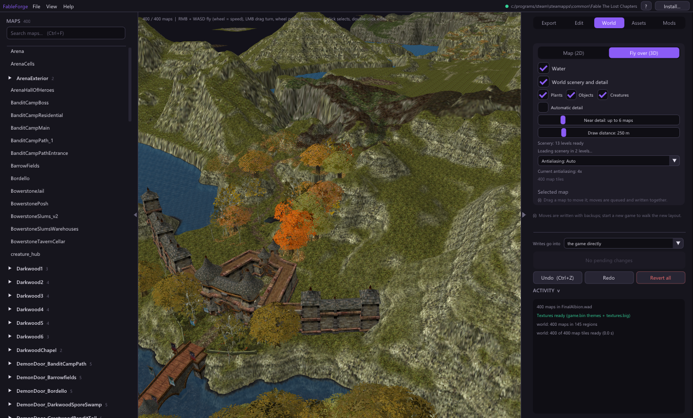
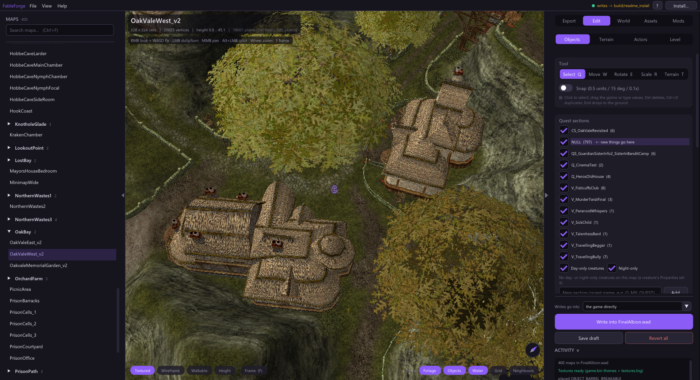

# FableForge

**Current preview: [0.18.0-rc.2](https://github.com/BuffJesus/FableForge/releases/tag/v0.18.0-rc.2)** — a deeper editor workflow pass, improved world view,
asset browsers for models, effects and dialogue, and safer mod and terrain writes.
See the [release notes](docs/releases/0.18.0-rc.2.md) for changes and validation limits.
The latest final release remains 0.17.1 while fresh-game and separate-machine
release checks are completed.

*Until 0.16 this was **Albion Atlas**; same tool, new name (the old FableForge's core
library lives on inside it as `libs/forgecore`). Settings and presets carry over.*

Explore, edit and export **Fable: The Lost Chapters** maps straight from your Steam
install. Forge has a 2D atlas and a 3D flyover of Albion, terrain and object editing,
model, texture, effect and dialogue browsers, and a mod load order with conflict
checks. Export a map to `.glb` or `.obj`, or write reviewed changes back into the
game. Three small Windows executables, no dependencies:

* **`FableForge.exe`** — pick your install, browse its maps on the left,
  see the map in 3D in the middle, export or edit on the right. Drag a `.lev`
  onto the window to open a loose file (drop a PNG to make a ground texture from it). Export one map or all of them.
* **`forge.exe`** — the same exporter as a command line tool.
* **`forge-tools.exe`** — the modding toolchain CLI (defs, quests, scripts, mods; `docs/modding/`).

Runs on anything with Direct3D 10-class graphics (falls back to the software
rasterizer if it has to).



## Editor at a glance

| Area | What you can do |
| --- | --- |
| **World** | Explore the whole level layout on a textured 2D map or fly through it in 3D with nearby terrain, water and scenery. Select a map to edit, move map positions, set region ownership and connect new neighbours. |
| **Edit** | Place, transform, duplicate, link and remove things with undo. Sculpt and paint terrain, set walkability, copy a region, generate terrain and fit its edges to neighbouring maps. Grounded things and baked foliage follow height edits in the preview. |
| **Assets** | Browse textures and models, inspect meshes and their users, preview particle systems against adjustable backgrounds, and inspect or edit dialogue lip sync with a 3D head and timeline. Build ground themes from PNG files. |
| **Mods** | Arrange supported packs and EgoCore folders in one load order, inspect conflicts and missing asset references, build, deploy and restore backed-up files. See [mod-pack limits](docs/modding/MOD_PACKS.md) before combining large overhauls. |
| **Export and tools** | Export textured maps and assets, inspect retail data, and use `forge.exe` or `forge-tools.exe` for repeatable command-line work. |



The [feature gallery](docs/FEATURE_GALLERY.md) shows the 2D World map, terrain
and brushes, effects, dialogue, mods, setup and budget survey. The
[Greatwood terrain](docs/screenshot_greatwood.png) and
[Arena export](docs/screenshot_arena.png) captures show two more editor views.

## Start in the editor

1. Unzip the [current preview](https://github.com/BuffJesus/FableForge/releases/tag/v0.18.0-rc.2)
   and run `FableForge.exe`. Choose the folder containing `Fable.exe` if it is
   not found automatically.
2. Pick a map on the left, or open **World** to find it on the 2D map or in the
   3D flyover. Double-click a map in World to open it for editing.
3. Use **Export**, **Edit**, **Assets** or **Mods** on the right. Start with
   [your first level](docs/FIRST_LEVEL.md) for a guided edit and safe save.

```
forge list                             # every map in FinalAlbion.wad
forge info   Greatwood_1               # size, height range, ground themes
forge export Greatwood_1               # -> Greatwood_1.glb, textured
forge export Oakvale_1 --out oak.obj   # OBJ + MTL + PNG instead
forge export my_edited.lev --no-textures
forge effects BRAZIERFIREFINAL         # what a particle effect is made of
```


## Get it

Download `FableForge-<version>-win64.zip` from the [Releases](https://github.com/BuffJesus/FableForge/releases)
page, unzip it anywhere and run `FableForge.exe`; it finds the Steam install by itself (or point it at one:
the folder that holds `Fable.exe`, not its `Data` folder). Nothing to install: the exes are static, Windows 10/11 needs nothing else.

Modded installs with the levels **extracted** (loose `Data\Levels\FinalAlbion\*.lev` / `*.tng`, the
WAD renamed to e.g. `_FinalAlbion.wad` so the game reads the loose files) work as they are: the map
list comes from the loose files and every level write (objects, terrain, new levels, world moves)
goes to the loose files. FableForge never recreates `FinalAlbion.wad` on such an install, since the
WAD would override every loose level.

New here? Read **[docs/FIRST_LEVEL.md](docs/FIRST_LEVEL.md)** -- your first level in ten minutes, with screenshots.

**Your install is safe.** Every file FableForge writes into the game is backed up first
(`forge backups` lists them); `forge restore` -- or *Restore backed-up files* on the GUI's Setup panel -- puts the backed-up
files back. Every writer refuses to touch an install the game is currently running from. The
engine's own rules (a new region needs a new game, saves cache a level's entities, ...) are in
[docs/ENGINE_RULES.md](docs/ENGINE_RULES.md).

## What you get

| Layer | Source | In the file |
|---|---|---|
| Heightmap mesh | `.lev` cell grid — one vertex per world unit, height = raw × 2048 | `POSITION` / `NORMAL` / `TEXCOORD_0`, two triangles per cell, Y-up (or `--up z`) |
| Ground texture | the engine's own texture passes from `FinalAlbion_RT.stb` (per 16x16 patch: texture id, mapping direction, per-vertex blend), composited with the engine's direction weights; loose `.lev` files without an STB entry fall back to the LEV 3-theme blend → `ENGINE_THEME` defs → `textures.big` | `baseColorTexture` on a rough, non-metallic material |
| Splat layers (`--layers`) | same, unbaked | `_THEME_INDEX` / `_THEME_WEIGHT` vertex attributes, one PNG per theme in `<name>_themes/`, and `<name>.themes.json` |
| Walkability (`--walkable-colors`) | `.lev` walkable byte | `COLOR_0`: white = walkable, red = blocked |
| Foliage (`--foliage`) | baked local-detail instances in `FinalAlbion_RT.stb` — grass, flowers, bracken, bramble, stumps **and trees** (oaks, birches...) — + LOD0 meshes from `graphics.big` + their textures | one glTF mesh per plant (leaves/trunk as separate primitives), one node per instance under a `Foliage` root; cutout (`MASK`) materials. OBJ: baked into an extra object |
| Water | LEV theme blend x `ENGINE_THEME` `WaterHeight` / `WaterType` (lakes, rivers, sea, Hook Coast ice) | `Water` child node with translucent `water` / `ice` materials; OBJ `o Water` |
| Particle effects (`--things --particles`, off by default) | `CREATEPARTICLE <fx>` mesh dummies and `PARTICLE_EMITTER_PLACEABLE` things name an entry of `data/Misc/pc/effects.big` (1,165 emitters, fully parsed) | each sprite system → a tinted crossed-quad proxy (its sprite texture, start colour, render size) named after the effect; mesh systems (sun beams, dust) → the mesh scaled to its render size; `CPSCLight` → `KHR_lights_punctual` point light. Static stand-ins — no animation |
| Placed objects (`--things`) | the map's `.tng` — fences, walls, rocks, lamps, crates, buildings, chests — resolved through their `game.bin` definition's `Graphic` model id (or `GraphicOverride`), **plus the parts a mesh spawns itself**: 3ds-Max dummies named `CREATEOBJECT <def>` / `CREATEBUILDING <def>` inside a mesh place doors, windows, weathervanes, the Arena's stands and entrances, chained cave/hall interiors (the engine's `CTCMeshAutomaticEntityCreator`) | same as foliage under a `Things` root; full orientation from `RHSetForward/Up`, `ObjectScale` honoured; children follow their parent's transform, recursively. Creatures only with `--creatures` (bind pose) |

The exporter never embeds retail data; it reads the textures from **your** install.

## Options

```
--out <path>        .glb (default, self-contained) or .obj (+ .mtl + PNG)
--install <root>    Fable TLC folder (default: auto-detect via Steam)
--no-textures       heightmap only; works without an install for loose .lev files
--foliage           add the baked grass/plants/trees as mesh instances (needs an install)
--things            add the placed objects from the map's .tng (needs an install)
--creatures         with --things: include creature meshes in bind pose
--particles         with --things: static stand-ins for particle emitters (off by default)
--no-water          leave out the water surface
--max-texture <px>  shrink object/plant textures to at most <px> per side (256 = files ~1/3 smaller)
--layers            also write splat attributes + one PNG per ground theme
--texels <n>        baked albedo texels per cell edge (default 8)
--tile <units>      world units per texture repeat (default 8 = the engine's)
--up <y|z>          y = glTF/Blender/Unreal convention (default), z = Fable native
--world             place the map at its WLD MapX/MapY so several exports line up in one scene
--origin <x,y>      explicit offset instead
--walkable-colors   COLOR_0 vertex colours
```

Numeric export options require complete values: decimal integers for `--texels`
and `--max-texture`, finite numbers for `--tile` and `--gain`, and two finite
coordinates for `--origin`. `--up` accepts `y` or `z`. Malformed or missing
values are refused before exporting; existing numeric clamps still apply.
An explicit `--origin` moves terrain, foliage and placed objects together and
takes precedence over `--world` when both are supplied.

Each GLB/OBJ export prepares its model, material files and theme/image sidecars
before replacing outputs. A failed replacement restores the earlier files in
that export; unrelated files are preserved. Batch exports handle each map
separately. Standalone exports do not create game-install backups.

## Known gaps (honest list)

* **Texture tiling** — pinned from the engine: the landscape vertex shader maps
  `u = x / 8, v = y / 8` (`CEngineLandscapePatch::PositionToTextureUVTransformU/V`,
  ±0.125 per axis), so one ground texture covers 8 x 8 world units; `--tile` overrides.
* **Cliffs are the engine's** — for retail maps the albedo is composited from the STB
  foreground passes: each pass carries its mapping direction (flat, or one of four
  horizontal projections with `v = -z/8`) and per-vertex blend, weighted with
  `GetMappingDirectionBlend` (flatness from `asin(n.z)`, direction falloff from the
  horizontal normal). Loose `.lev` files without an STB entry use the older slope
  heuristic. `--layers` still exports the LEV theme splat for people building a shader.
* **Foliage frames are found by grammar, not by directory** — every LZO frame
  in the map's STB chunk that parses as a cache-group collection is used (type-1
  grass batches, type-0 single meshes incl. trees, and type-2 z-sprite batches —
  distant trees the engine draws as impostors; exported as full meshes, far-LOD
  twins of a near tree dropped). Counts per mesh are in the log.
* **Terrain brightness** — Fable's ground textures are authored dark; the engine's
  own baked background patches are equally dark (checked with `forge ground <map>`),
  so the in-game look comes from lighting. The export keeps raw texels; `--gain` /
  the brightness slider brighten if you want a lit look baked in.
* **Caves have no lid** — terrain is the cave floor; walls and ceilings are placed
  meshes. Every cell of every map is drawn by the engine (`forge coverage <map>`).
* **Placed-object orientation** — meshes compose exactly as the engine's
  `CalcObjectMatrix` does: `pos + lx*(-right) + ly*(-forward) + lz*up` (`right = forward x up`),
  cross-checked against the Arena (oval pit, N/S corridors, gates, audience ring and
  billboard facing, `MINIMAP_ARENA`) and Oakvale's fence lines. Objects that float in the
  export float in the data too — except for parts a mesh spawns through its own
  `CREATEOBJECT` / `CREATEBUILDING` dummies (see the table), which are now followed.
* **Particles are off by default** (`--particles` opts in) — a flame is a small tinted
  sprite quad, a fountain a stack of them, a sun beam its mesh; nothing moves. The real
  emitter parameters are in the effect name (`forge effects <NAME>`).
* **Water** — a `Water` sheet (child of the terrain node; `water` + `ice` materials, OBJ
  `o Water`) built the way the engine's water patches are: ground + the LEV theme blend
  times each `ENGINE_THEME`'s `WaterHeight` (a depth), averaged over the 5x5 neighbourhood
  and extended two cells onto the bank, placed 0.1 below that level, with the in-game
  depth fade (transparent at the shore, opaque 2 units down) exported as `COLOR_0` alpha
  (`CEngineMap::PeekInterpolatedWaterHeight`, `CWaterPatchMesh::Build`). Flat colour
  only — no waves, reflections or shore foam.
* **Stale theme indices** — retail LEVs store `game.bin` indices from an older bank
  (Bowerstone Bridge's `WATER_BWLAKE_8` slot points at what is now `WATER_BWLAKE_1`);
  the palette NAME wins whenever it disagrees with the index, for textures and water alike.
* **No lights, particles, creatures (by default), scripts.**
* **Editor gaps** — a lone new level shows the grey void beyond its edges (retail
  surrounds every level with filler/sea maps); the *Enemy spawner* card writes the
  retail generator block but the engine has not been seen spawning from a new one yet
  (retail generators are activated by something outside the TNG, see `docs/PLAN.md`);
  the minimap/texture append path needs Python next to a FableTLC checkout
  (`tools/texture_build.py`) like every earlier release.

## GUI

```
FableForge.exe [--install <fable-root>]
```

Left: searchable map list grouped by the game's regions from `FinalAlbion.wld` (Ctrl+F);
`Export region` writes every map of the selected map's region in world coordinates so
they assemble themselves in Blender. Middle: the 3D view with
Unreal-editor controls — hold **RMB** to look around and fly with **WASD**
(**Q/E** down/up, **Shift** faster, wheel changes fly speed); **LMB** drag
dollies/turns, **MMB** drag pans, **Alt+LMB** orbits, wheel zooms, **F** frames
the map. Textured / Wireframe / Walkable / Height views, Foliage toggle. Right:
export settings, `Export <map>` (Ctrl+E), `Export all`, activity log. Settings
are remembered in `%APPDATA%\FableForge`.
The UI is DPI-aware and uses compact controls when panels narrow. The main panes and
their menus have been checked at 800 x 600 with 1.5x UI scale.

## Editing a level

Switch the right panel to **Edit**. This is the part of FableForge that replaces the
leaked Lionhead debug editor for the everyday job of laying out a level, without the
crashes and with undo. See [docs/EDITOR.md](docs/EDITOR.md) for the details.

* **Click** an object in the viewport to select it (outlined). **Q/W/E/R** switch
  between select, move, rotate and scale; drag the gizmo or type the position, yaw
  and scale in the panel. **End** drops it onto the terrain, **F** frames it.
* **Ctrl+D** duplicates, **Del** removes, **Ctrl+Z / Ctrl+Y** undo and redo.
* *Objects in this map* lists every placed thing (filter by definition or script name;
  double-click to fly to it). *Add an object* searches every `OBJECT_` / `BUILDING_` /
  `CREATURE_` definition in `game.bin` and places it where the camera looks, on the
  ground, facing you (creatures as the game's own AICreature things: NPCs, animals,
  guards).
* *Changes* summarises what differs from the original by UID. **Write into
  FinalAlbion.wad** puts the edited file into the archive the game actually loads
  (the primary action); **Save draft** keeps a loose
  `data/Levels/FinalAlbion/<map>.tng` working copy that only FableForge reads. Both keep
  a one-time `.forge-orig` backup of what was there.
* When you place a creature or spawner, or create a level with its own region, a
  note under that button repeats the engine rule that applies (new game / adult
  hero / region table cached in saves). *Got it* hides it for the session.
* **Terrain (T)**: raise / lower / flatten / smooth brushes and walkable / blocked
  painting straight on the ground (hold LMB, Shift inverts, `[` `]` resize; each
  stroke is one undo step). **Write terrain into the game** writes the `.lev`, replaces
  it in `FinalAlbion.wad` and re-bakes the map's terrain chunk inside
  `FinalAlbion_RT.stb` from the edited heights, with the neighbouring maps supplying
  the shared-edge samples, so the visible mesh, collision and camera bounds all follow.
  The simplified distant-view patches are re-sampled too, so the map looks right from
  afar, and a tall edit whose patches no longer fit their old slots grows them (the
  chunk is re-laid). `forge-tools stb patch-heights` checks every patch against the `.lev`.
  One-time `.forge-orig` backups. The chunk's trees and grass ride the sculpted
  ground; grounded placed things follow the edit in the preview and undo step.
  Terrain and object positions have separate game writes, both named in the panel.
* **Paint ground**: brush any ground theme of the map's palette, add any
  `ENGINE_THEME` the game has to the palette, or turn your own PNG into a theme
  (*Assets* tab, *Ground themes*: appended to `textures.big` + a new `ENGINE_THEME`
  in `game.bin`, nothing retail replaced). Saving rebuilds the map's layer meshes so
  the game draws the new material.

* **Live link**: with ForgeFSE installed, one click hooks a tiny Lua thread into the
  running game -- jump the hero to the spot you are looking at, spawn the selected
  creature there, let the camera follow him. No native code, removable.
* **World** (third tab): Albion's textured ground on a 2D map, with a 3D flyover
  that loads nearby terrain, water and scenery as you travel. Select or open a
  level from either view. On the 2D map,
  Drag a map to a new 32-aligned spot (overlaps refused, touching neighbours
  highlighted), queue as many moves as you like, then **Move N maps into the game**:
  the WLD/BWD placement and the map's terrain chunk (ground, LOD, water, trees and
  grass) are rewritten for the new origin. The same panel sets which region owns a
  map and which regions draw it across each edge, and can stitch the shared
  edge heights of newly adjacent maps. Same thing from the shell:
  `forge world` / `world-move <map> <x> <y> [--stitch]` / `world-owner` /
  `world-sees` / `world-stitch`.

Everything is written the way the game wrote it: untouched things stay byte-identical,
moved things get their position/basis lines rewritten in retail float spelling, new
things use retail field order and the per-file UID namespace.

## Custom models

*Models* (Assets tab) or `forge mesh-import <model.glb|.gltf|.obj> <NAME>
[--texture png]` turns a static model into a placeable `OBJECT_<NAME>`: the mesh is
appended to `graphics.big` with a collision hull (the hero walks into it, not through it),
its texture to `textures.big`, and a definition to `game.bin` copied from a donor object.
Model space is metres; the game's is centimetres, so the importer scales by 100.
Static meshes only for now: no skinning, no animation.

## Mod packs

The **Mods** tab keeps one load order for every kind of Fable mod: `.fmp` packs,
game-root folders, bsdiff `.patch` files, `.qst` edits, EgoCore `Mods/<Name>/` folders
(DLL + text `.def` + `.resource` bank overrides + partial TNGs) and whole-file packs like
Project Seasons. Mods merge record by record (a `game.bin` field, a thing by UID, a
`.qst` statement, a `text.big` key, an `FSE/quests.lua` entry) and later mods win.
*Check conflicts* lists every contested record in one report where you pick the winner.
*Build and deploy* rebuilds the whole order onto the retail files; *Undeploy* puts them
back. Things a mod placed are badged in the editor with the mod's name. Shell:
`forge-tools mods list/add/remove/move/enable/disable/build/deploy/undeploy/conflicts`.
These commands reject unknown or incomplete options before editing the order or
reverting a stage. Reorder indices must be complete signed decimal integers.
Missing or unreadable conflict-choice files are errors; deploy reads the order
and choices and validates enabled source paths before reverting the previous stage.

## Building

```
cmake -S . -B build -G Ninja -DCMAKE_BUILD_TYPE=Release
cmake --build build
build\fableforge_tests.exe            # unit tests (synthetic .lev, no install needed)
python tools\retail_smoke.py --count 12  # exports real maps and validates every GLB
python tools\ui_smoke.py                 # drives the GUI, validates output + screenshots
python tools\check_all.py                # everything above
```

The GUI is tested by scripting itself (`--auto`, see `docs/AUTOMATION.md`): real
clicks on real widgets, state assertions, and pixel checks on backbuffer screenshots.

MinGW-w64 (WinLibs) or MSVC, C++20. The format parsers are a pinned snapshot
of the original FableForge toolchain's `forgecore` (now `libs/forgecore`, see `vendor/VENDORED.md`).
MIT licensed; the shipped binaries contain no GPL code (LZO1X decoding is a
clean-room implementation verified against minilzo in the test suite).

## Credits

Thanks to [**AeoN (AlbionSecrets)**](https://github.com/eeeeeAeoN) for
[EgoCore](https://github.com/eeeeeAeoN/EgoCore)
([Nexus page](https://www.nexusmods.com/fablethelostchapters/mods/592)).
Its open source asset work and modding workflows have been a major reference and
inspiration for Forge. Particle field layouts and selected preview behavior
were adapted or checked against EgoCore under its MIT license; the upstream
license is included in [EgoCore-LICENSE.txt](vendor/EgoCore-LICENSE.txt) and the
scope is recorded in [THIRD_PARTY.md](vendor/VENDORED.md).

[Fable: Aeon Edition](https://www.nexusmods.com/fablethelostchapters/mods/454)
is a separate overhaul by Alexander The Alright. We use it in compatibility
research and scratch tests; its assets are not distributed with Forge.

Format knowledge also comes from the FableTLC decompilation project, the
original FableForge core, and FableMod / ChocolateBox references. Thanks to
the Fable modding Discord for testing and sharing findings.

Editor status and the plan: `docs/EDITOR.md`, `docs/PLAN.md`.
