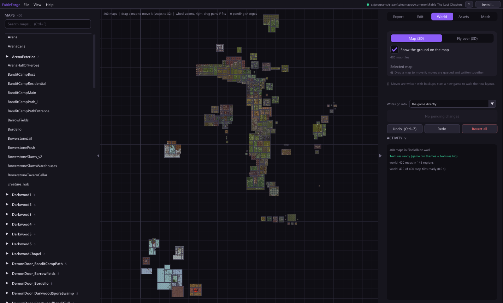
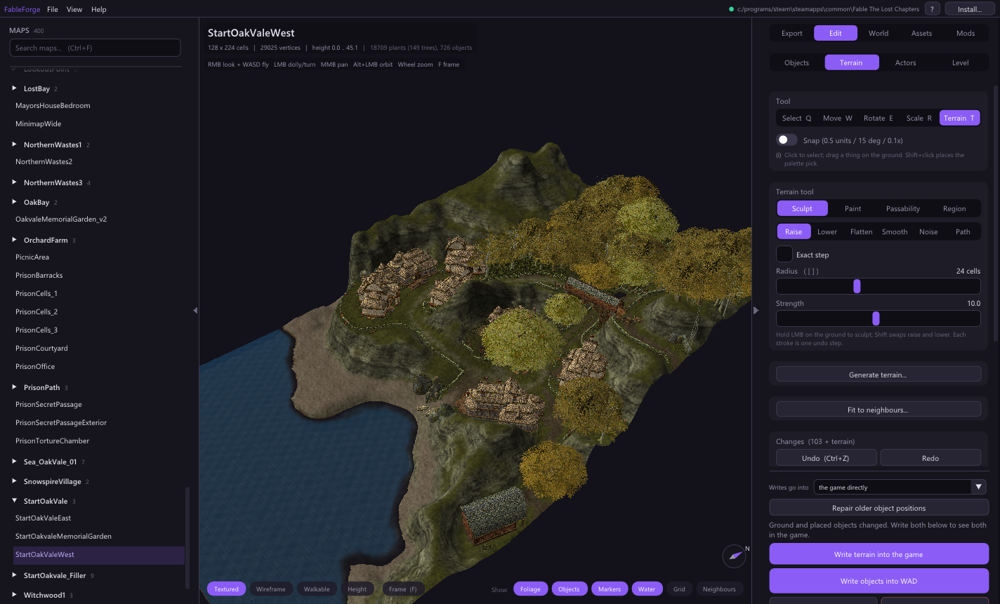
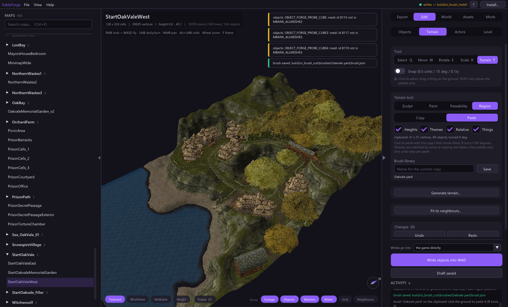
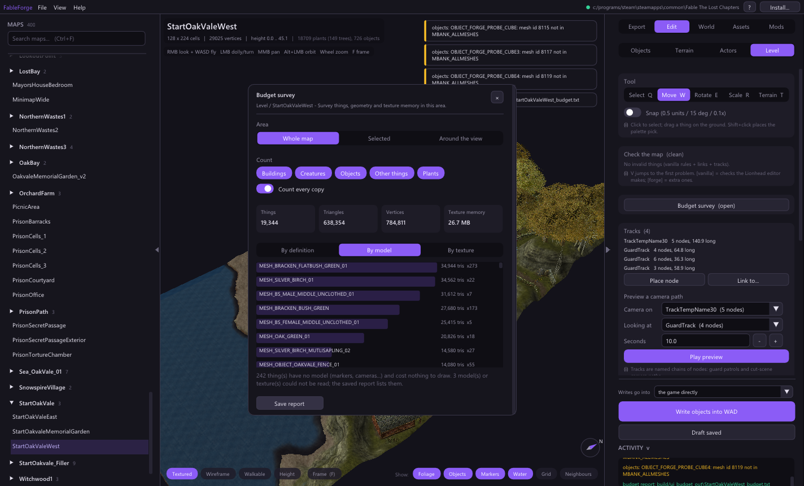
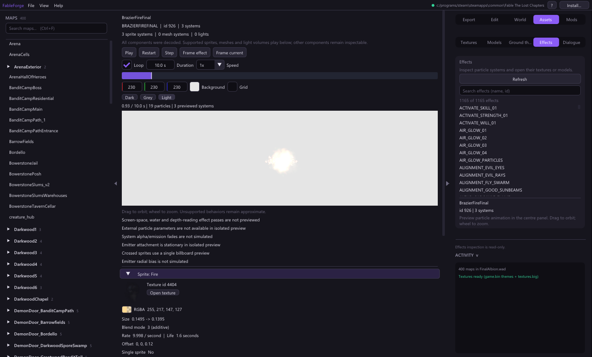
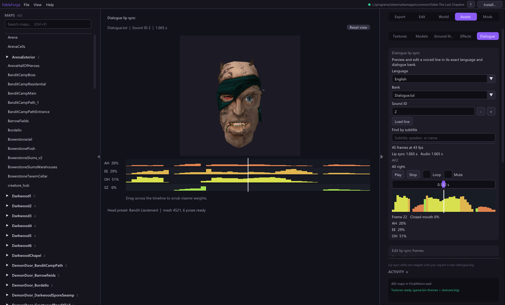
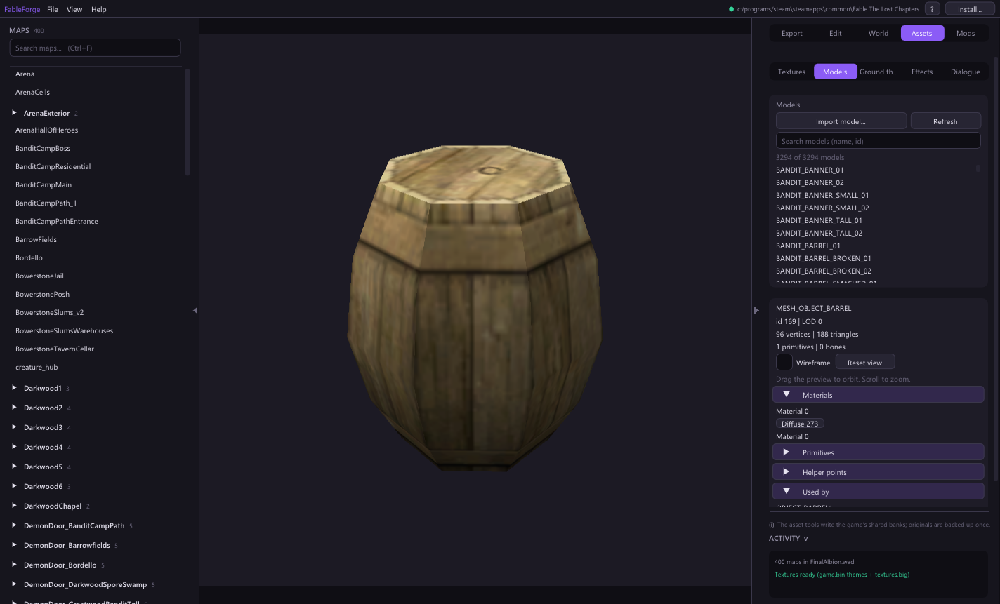
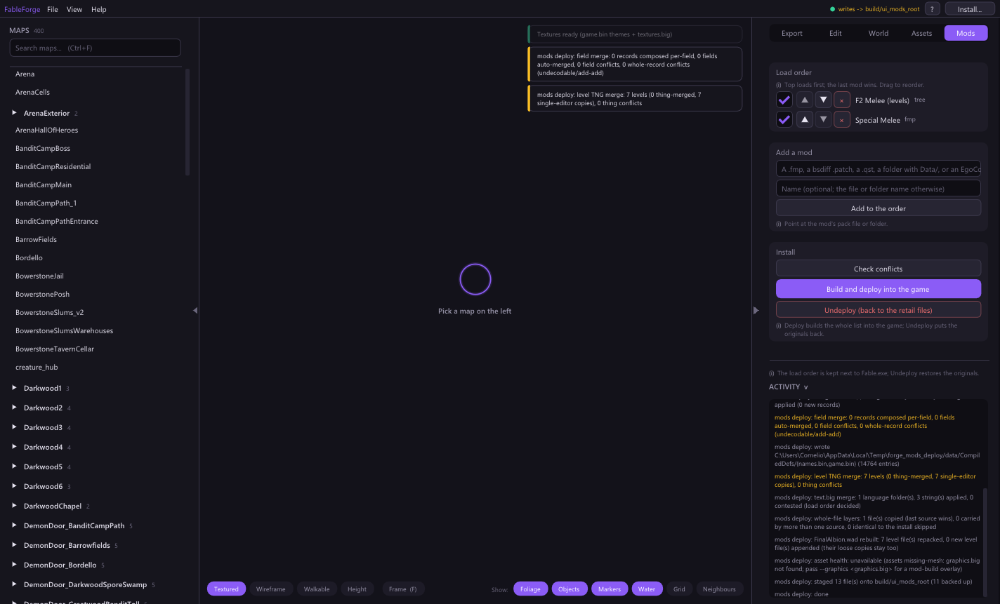
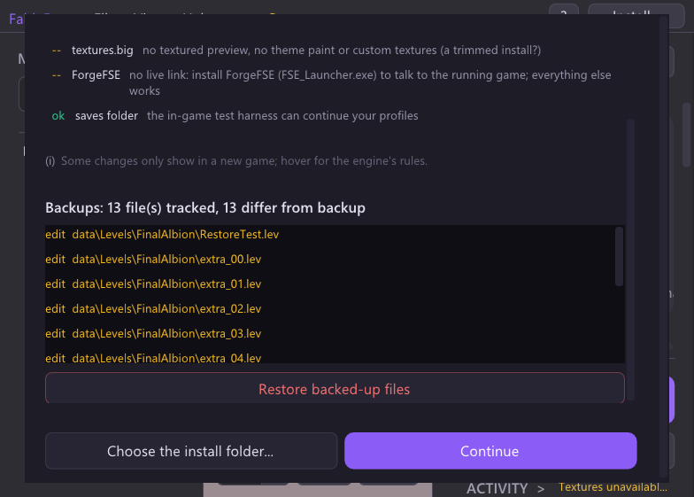

# FableForge feature gallery

These screenshots were captured from the 0.18.0-rc.2 editor against retail Fable:
The Lost Chapters data or isolated scratch installs. They show representative
workflows; the [editor guide](EDITOR.md), [mod-pack guide](modding/MOD_PACKS.md),
and [release notes](releases/0.18.0-rc.2.md) explain the controls and limits.

## Explore Albion

The World tab shows all maps on a textured 2D layout. You can select a map,
inspect its neighbours and queue a new position.

Fly over the same layout in 3D. Nearby terrain, water, buildings and plants load
as you move; a map can be opened directly into the editor.

## Edit terrain and level content

Sculpt and paint terrain, change walkability and undo a stroke. Grounded placed
things and baked foliage follow raised terrain in the preview. The panel calls
out the separate terrain and object writes needed to see both changes in game.

Copy a region with heights, themes and things, then paste or save it as a brush.
The Terrain tab also offers Generate and Fit to Neighbours.

The level budget survey counts things and estimates geometry and texture use in
a map, selection or nearby view.

## Inspect assets

The Effects browser previews particles with playback controls, a background
colour choice and a ground grid. Its simulation is an approximation of the
retail engine.

The Dialogue browser joins retail audio, subtitles and lip sync. It previews
mouth poses on a 3D head, exposes the timeline and can stage frame edits for a
scratch export.

The Assets tab also has texture, model and ground-theme browsers; the model
browser shows geometry, materials, textures and definition users.

## Manage mods and recovery

The Mods tab keeps a load order for supported packs, reports conflicts and
missing asset references, and builds or undeploys the order.

Setup shows install health and tracked backups. Restore returns files to their
backed-up bytes and reloads the open map.

For repeatable captures, see the UI scripts under `tests/ui/`. The screenshot
set is a tour of the main workflows, not a picture of every command or dialog.
