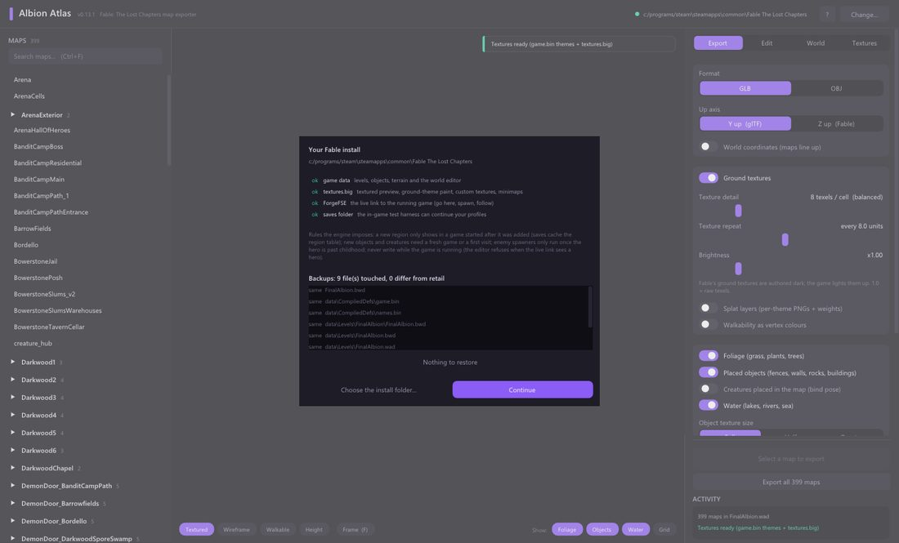
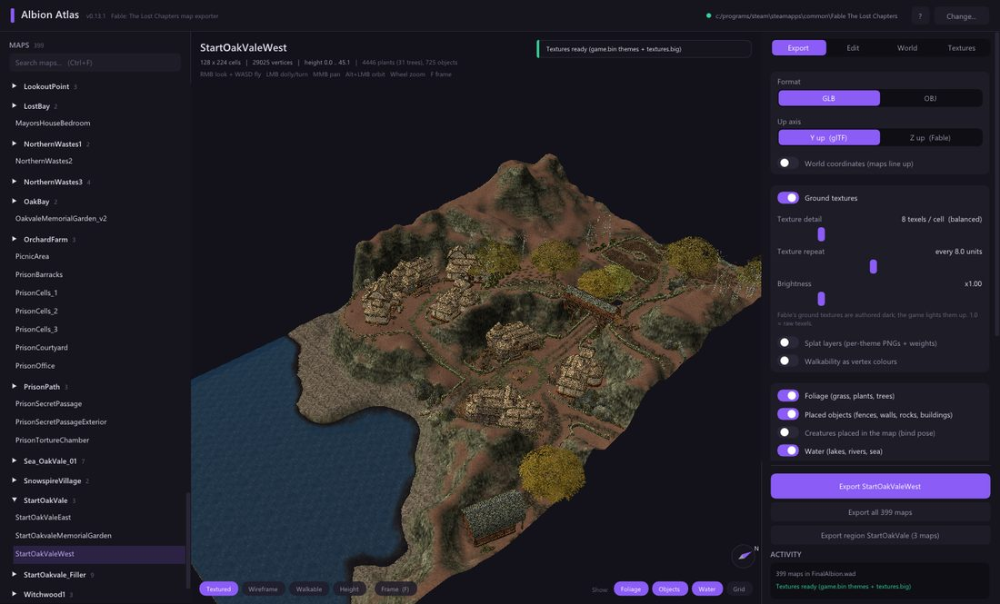
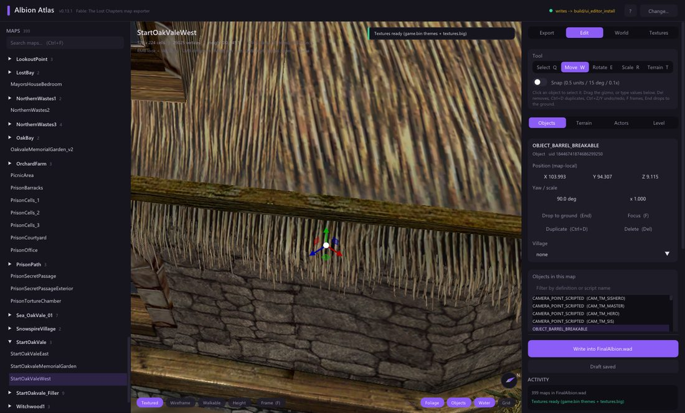
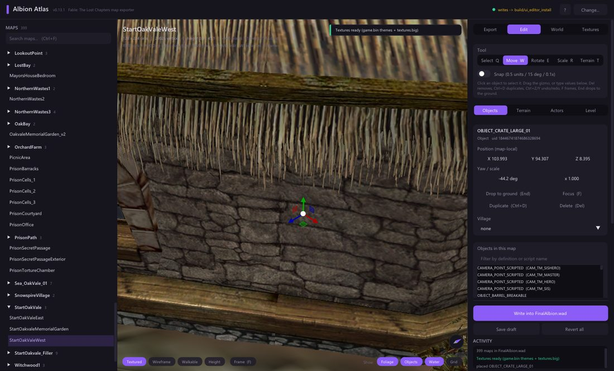
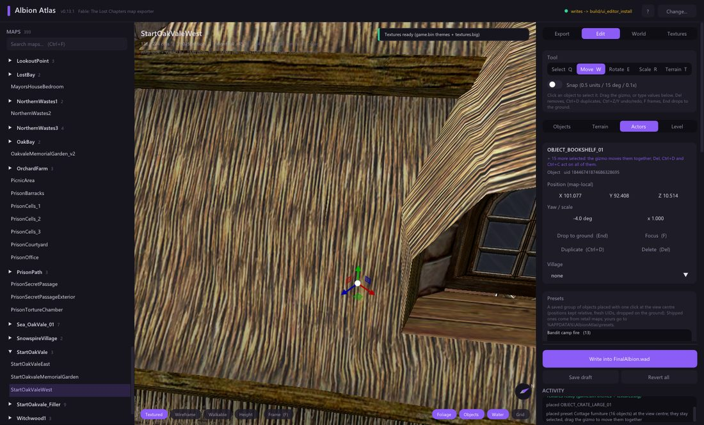
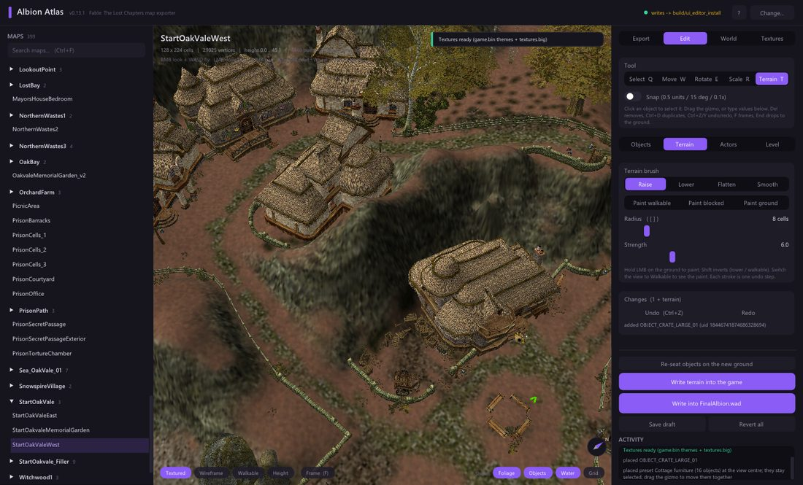
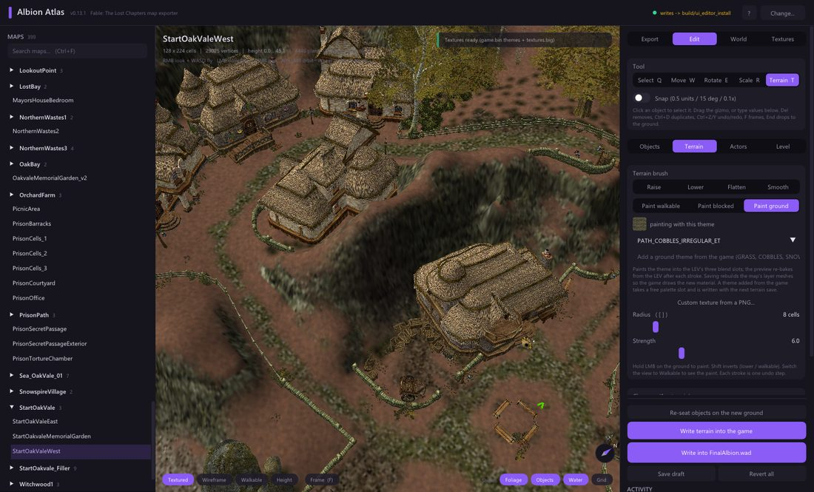
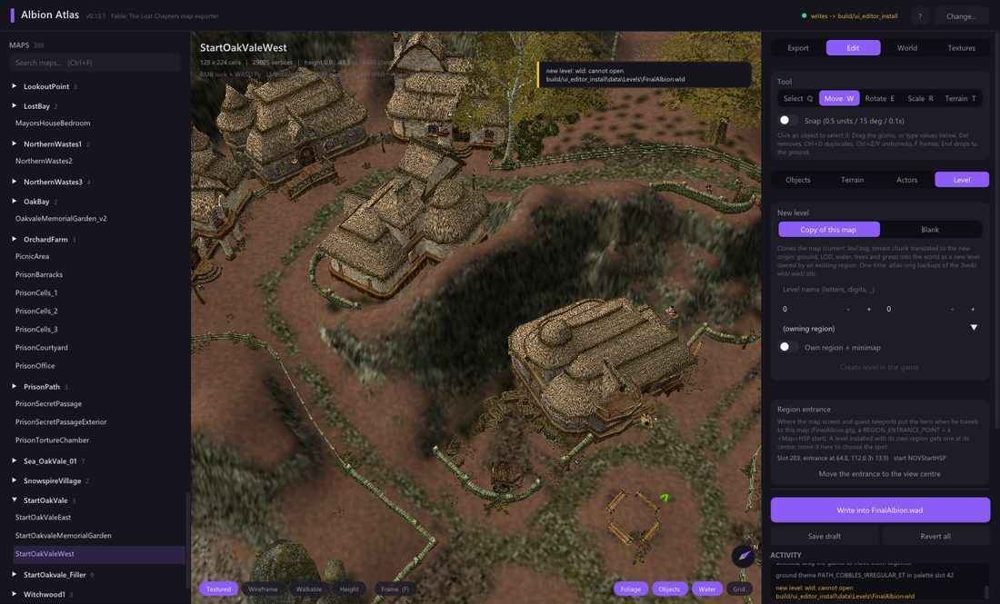
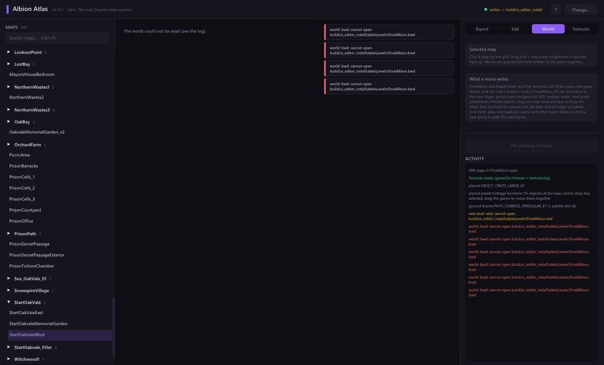
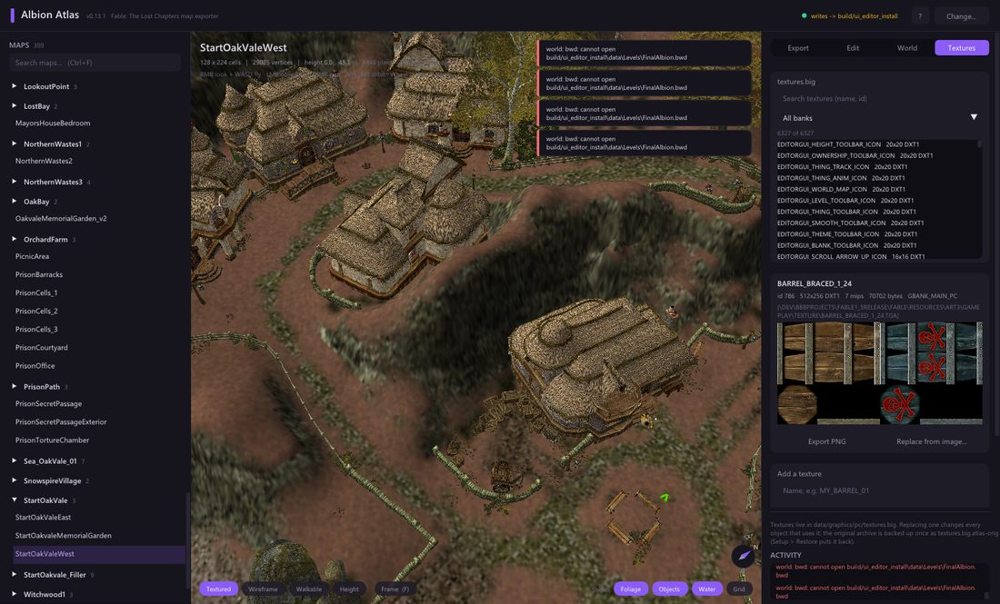

# Your first level in ten minutes

FableForge edits the real game files and the game loads what you write. This
walkthrough goes from a fresh install to a level of your own that the map screen
can travel to. Every screenshot here was taken by the app's own test harness on
the retail Steam install, so what you see is what the tool does today.

Before you start: **close Fable**. FableForge refuses to write while the game runs
(it would crash it), and every game file it touches is backed up once as
`<file>.atlas-orig` -- *Setup > Restore the retail files* puts everything back.

## 1. Point it at the game

Unzip anywhere, run `FableForge.exe`. The first run opens the Setup panel:
FableForge looks for Fable on every drive (Steam and GOG defaults) and shows what it
found -- the WAD with the 399 maps, `textures.big`, `game.bin`, your saves, and
whether ForgeFSE is installed (only needed for the live link). Pick *Change...* if
it guessed wrong. The panel also lists the engine rules that no tool can bend
(new regions only show in a game started after they were added, and so on); they
come back as notes next to the action they apply to.

## 2. Look around

Pick a map on the left (search with Ctrl+F). The viewport shows the ground with
its real textures, the placed objects and the baked foliage. Right-drag + WASD
flies, left-drag turns, the wheel zooms, F frames the map. The chips at the
bottom switch the view (Textured / Wireframe / Walkable / Height) and the layers
(Foliage / Objects / Water / Grid); `?` opens the full cheat-sheet.

## 3. Move something

Open the **Edit** tab. Click an object in the viewport (you hit what you see --
the real mesh) and the gizmo appears: W moves, E rotates, R scales, Q selects.
Del removes, Ctrl+D duplicates, End drops to the ground, Ctrl+Z undoes. The
*Selection* card shows the object's position and its village. Ctrl+click adds
more objects to the selection; the gizmo then moves them together.

## 4. Place something

*Add an object*: search any `OBJECT_`, `BUILDING_` or `CREATURE_` definition of
the game and press *Place at view centre* -- it lands on the ground where you are
looking, facing you. Creatures are placed as the game's own AI creatures (a
villager, a guard, a chicken); the note under the button tells you the engine
rule: existing saves will not show them, start a new game or enter the map fresh.

The **Actors** tab holds the bigger pieces: a *Village* (join buildings and
creatures to it), an *Enemy spawner* (bandits, hobbes, wasps... when the hero
comes near -- adult hero only), a *Particle effect* (fires, smoke, butterflies),
and *Presets*: whole groups of objects placed with one click. Four ship with
FableForge (a bandit camp fire, an Oakvale fence and gate, cottage furniture, a
graveyard corner); *Save N selected objects as a preset* makes your own.

## 5. Shape the ground

The **Terrain** tab (or press T) sculpts: Raise / Lower / Flatten / Smooth with a
round brush (`[` `]` resize, Shift inverts), and paints walkability (the engine's
navigation is patched in place, so what you paint is where the hero can walk).
Objects standing on ground you raise can follow it (*Re-seat objects*).

*Paint ground* paints any ground theme of the game (grass, cobbles, sand, snow --
add one from the game's library, or make a *Custom texture from a PNG*, or just
drop a PNG onto the window). Each theme shows its swatch.

## 6. Write it into the game

Two buttons at the bottom of the Edit tab:

* **Write into FinalAlbion.wad** -- objects. The game reads levels from the WAD
  and nothing else, so this is what makes your edit real. *Save draft* only keeps
  a loose `.tng` working copy for FableForge.
* **Write terrain into the game** -- heights, walkability and painted themes:
  the `.lev`, the WAD entry and the map's terrain chunk in `FinalAlbion_RT.stb`
  are rewritten (a few seconds; the button shows the stage).

Every write asks once, names the files and keeps a one-time backup.

## 7. Your own level

The **Level** tab creates a new map: a *Copy of this map* placed elsewhere in the
world, or a *Blank* one of any retail size with one ground theme. Turn on *Own
region + minimap* and it gets its own name on the map screen, a minimap baked
from its terrain, and a **region entrance** at its centre (the spot the map
screen drops the hero on -- move it from the *Region entrance* card). Then edit
it like any other map. Engine rule: saves cache the region table, so **start a
new game** to see the new region.

The **World** tab shows every map on the overworld grid. Drag a map to move it
(the terrain chunk moves with it, seams can be stitched), change which region
owns it and which regions see it; *Write N region changes into the game* applies
the lot.

## 8. Retexture something

The **Textures** tab browses `textures.big`. With an object selected its
textures are listed first: pick one, *Export PNG*, paint over it, *Replace from
image* -- every object using that texture changes. *Add a texture* appends a new
one for your own defs and themes.

## What cannot be done (yet)

| You want | Today |
|---|---|
| A new region to show in an existing save | It cannot; saves cache the region table. New game. |
| A spawner to fire in the childhood prologue | It cannot; the engine gates generators on an adult hero. |
| Foliage painted onto a retail map | Not yet (the local-detail writer only covers levels authored from scratch). |
| Custom meshes / creatures / animations | Not yet in FableForge; the FableTLC toolchain does it from Python. |
| Editing while the game runs | Refused on purpose; the live link (ForgeFSE) can teleport the hero and spawn creatures, nothing more. |

Everything else -- the exact file formats, the engine rules and their evidence,
the automation that took these screenshots -- is in `EDITOR.md` and
`AUTOMATION.md`.
