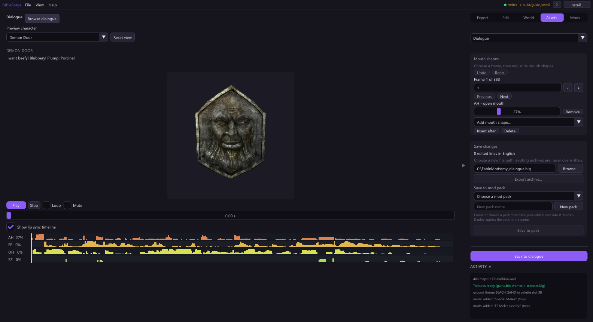

# Dialogue lip sync

**Assets > Dialogue** lets you find any spoken line, hear it on a character's
head, and change the mouth shapes the game plays with it.

## Find a line

Press **Browse dialogue**. Lines are grouped by speaker; expand a speaker for
each subtitle, or type in the search box to search every dialogue bank. Choose a
line to load it.

**Preview character** picks one of 18 retail heads to perform the line. **Play**,
**Stop**, **Loop** and **Mute** control playback; drag the time bar to scrub.
*Show lip sync timeline* draws each mouth shape's strength over the whole line.

## Edit the mouth shapes

Press **Edit lip sync**. The face stays visible while you edit.

- Go to a frame with **Previous** / **Next**, or type its number (the - and +
  buttons step by one; hold Ctrl for ten).
- Each frame holds up to four **mouth shapes** (AH open mouth, EE, OH, MM...).
  Drag a shape's slider to change its influence, **Remove** it, or use **Add
  mouth shape...**. An empty frame has no shapes until you add one.
- **Insert after** and **Delete** add or remove whole frames.
- **Undo** / **Redo** (Ctrl+Z, Ctrl+Y) keep up to 64 edits per line, including
  after you switch lines or banks. A slider drag undoes as one edit.

Edits are staged per line until you save them; *edited lines* counts them.

## Save your changes

You have two choices:

- **Save to mod pack** (recommended): choose a pack or type a name and press
  **New pack**, then **Save to pack**. The pack stores only your edited lines, so
  it combines with other mods. Use **Mods > Build and deploy** to put it in the
  game. When two packs edit the same line, the later one in the load order wins.
- **Export archive...**: writes a complete edited `dialogue.big` to a new path
  you choose. Existing archives are never overwritten. This is for inspection or
  manual distribution; deploying through a pack is safer.

The heads are previews built from the game's own meshes and animations. The game
can still differ slightly from the preview, so check important lines in the game.
