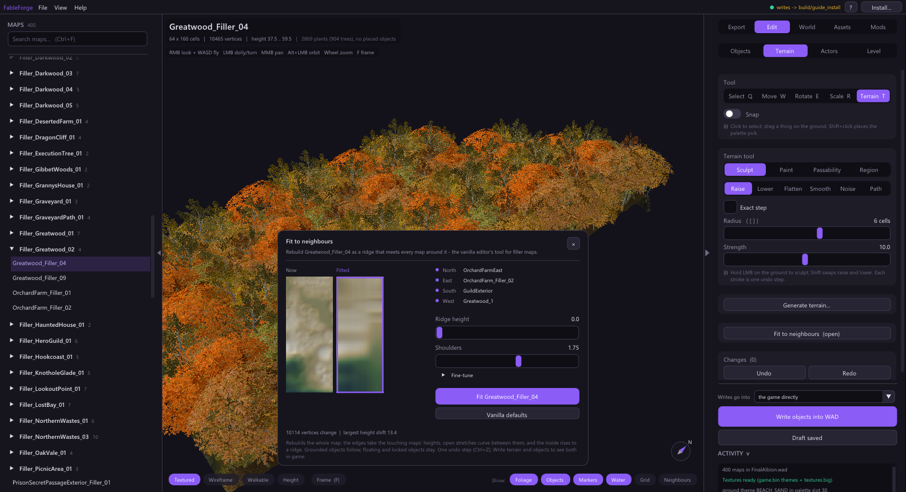

# Fit to neighbours

Fable joins its maps with small *filler* maps. When you move a map on the
**World** tab or reshape the ground near an edge, the filler between them no
longer lines up. **Fit to neighbours** rebuilds a filler so its edges meet every
touching map. It is a port of the vanilla editor's Fit Neighbours tool.

1. Open the filler map, then **Edit > Terrain > Fit to neighbours...**. A tool
   window opens beside the view.
2. Check the list of touching maps (north, east, south, west). Only maps that
   actually touch this one are used.
3. Compare **Now** and **Fitted**. The previews are lit from the side so ridges
   and seams show.
4. Adjust **Ridge height** (how far the middle rises above the edges) and
   **Shoulders** (how the open stretches curve between edges). *Fine-tune* has the
   remaining parameters; **Vanilla defaults** puts all of them back.
5. Press **Fit <map>**. The line under the buttons tells you how many vertices
   change and the largest height shift before you commit.

The whole map is rebuilt in one undo step (Ctrl+Z). Grounded objects follow the
new ground; floating and locked objects stay where they are.

To see the result in the game, write both the terrain and any objects that moved:
**Write terrain into the game** and **Write objects into WAD**. With a pack chosen
under *Writes go into*, both go into the pack instead.

**Generate terrain...** next to it replaces every height of the map with a
fractal landscape (the vanilla editor's generator). It sets every height rather
than adding to them, so run Fit to neighbours afterwards if the edges must meet.
