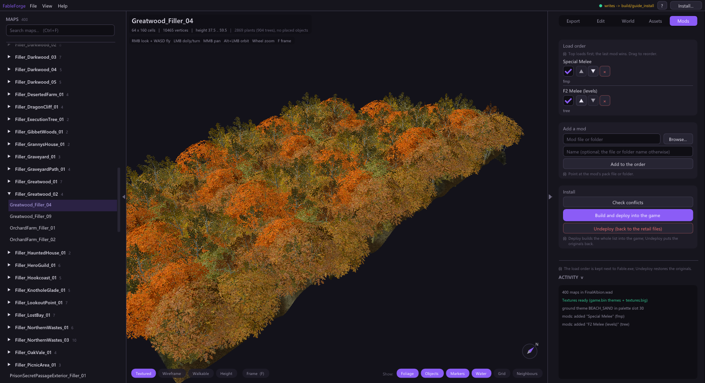

# Mod packs and load order

The **Mods** tab keeps one ordered list of every mod you want, builds them
together onto the retail files and can undo the whole deploy. Mods are merged
record by record, so two mods that change different parts of the same game file
both keep their changes.

## Add mods

Under **Add a mod**, browse to the mod's file or folder, optionally give it a name,
and press **Add to the order**. Supported kinds:

- Fable Mod Packages (`.fmp`)
- binary patches (`.patch`)
- quest files (`.qst`)
- folders containing a `Data/` tree
- EgoCore `Mods/<Name>/` folders
- FableForge packs (folders with `forge_pack.json`)

The tick box beside each row turns a mod off without removing it.

## Order them

The **top loads first and the last mod wins**. Drag a name, or use the arrows,
to reorder. Game records, a level's objects, text strings and world maps/regions
are merged; whole files such as texture banks come from the last mod that ships
them.

A FableForge pack can declare the mods it **requires**: right-click its row and
tick them. A pack whose requirements are missing or ordered after it is flagged in
the list and by the build.

## Check conflicts

**Check conflicts** dry-runs the whole order. Each row gains *wins* and *loses*
counts, and the Conflicts card lists every record, object, quest, string or file
that several enabled mods change differently. Edits that agree are not
conflicts. For each conflict you can keep the load-order winner, pick another
mod, or pick *vanilla*. Your picks are saved and applied by the next deploy.

## Deploy and undeploy

**Build and deploy into the game** undoes the previous deploy, builds the whole
order onto the retail files and installs the result, keeping the originals.
**Undeploy** puts the retail files back. Both refuse while Fable runs. The
Activity log shows the build's progress and any refused input; an invalid mod is
rejected before the previous deployment is replaced.

After a deploy, the Edit tab marks objects that a mod placed or changed.
*Placed by* filters the object list by mod, and *Back to retail* on a selected
object records a vanilla pick for the next deploy.

## Make your own pack

Your editor work can go into a pack instead of straight into the game:

1. Create a pack from **Assets** (*Models*, *Ground themes* or *Dialogue*:
   **New pack**). It joins the load order.
2. At the bottom of the Edit panel, set **Writes go into** to that pack.
3. Object, terrain, world and new-level writes now go into the pack. Nothing in
   the game changes until **Build and deploy**.

Packs are folders you can share; another FableForge user adds the folder to their
order. The format and merge rules are in [MOD_PACKS.md](../modding/MOD_PACKS.md).
For Aeon Edition with Controller Support, follow the
[Aeon/controller walkthrough](../walkthrough/aeon-controller/index.html).
