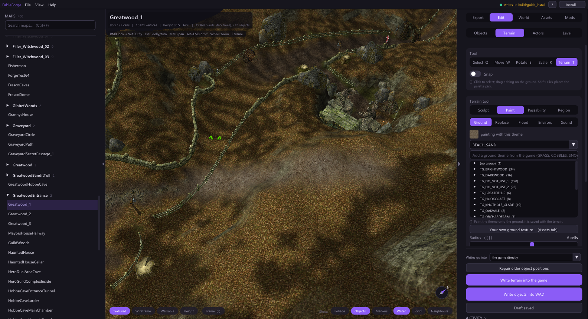
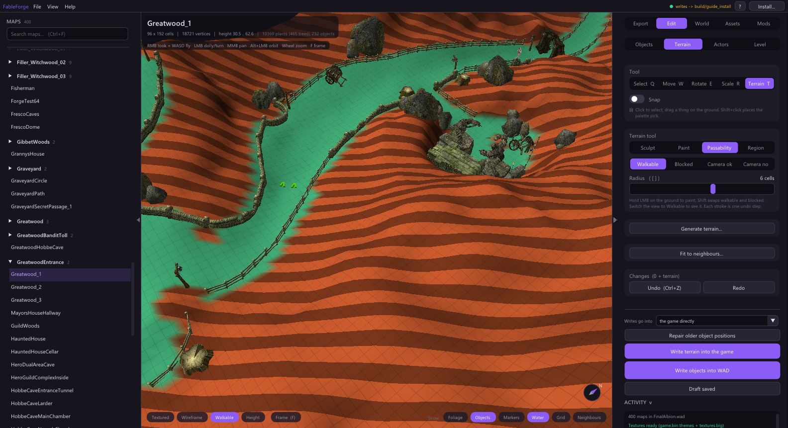

# Paint the ground

Open a map, then **Edit > Terrain** (or press T). The **Terrain tool** card has
four groups: **Sculpt** (heights), **Paint** (what the ground looks and sounds
like), **Passability** (where the hero and camera may go) and **Region** (copy and
paste). This page covers Paint and Passability. Every stroke is one undo step
(Ctrl+Z).

## Ground textures

1. Choose **Paint > Ground**.
2. Pick a theme under *painting with this theme*. The list holds the map's own
   palette. To use another theme from the game, type in *Add a ground theme from
   the game* (grass, cobbles, snow...) and choose one; it takes a free palette
   slot. The engine's placeholder (`INVALID_THEME_STANDIN`) is not offered; until
   you pick a theme, painting is refused with a note.
3. Hold the left mouse button on the ground. **Radius** sets the brush size
   (`[` and `]`), **Strength** how quickly the theme blends in.

Hide **Foliage** in the chips at the bottom of the view to see the ground under
trees. Your own picture can become a theme too: *Your own ground texture...*
opens **Assets > Ground themes**.

**Replace** turns one theme into another under the brush. **Flood** does it for a
whole connected patch with one click, like the vanilla editor. For both, Ctrl+click
the ground to pick the theme to paint and Ctrl+Shift+click to pick the theme to
replace.

**Environ.** and **Sound** paint the map's environment (lighting and atmosphere)
and ambient sound regions. Ctrl+click samples what is already under the cursor.
With *(no sound)* chosen, **Clear all sounds on this map** removes every ambient
sound in one step; with a sound chosen, the same button fills the whole map with it.
Older `.lev` files without a game-map grid do not offer these two.

## Walkable and camera areas

Choose **Passability**, then switch the view to **Walkable** (bottom left). Green
is walkable, red is blocked.

- **Walkable / Blocked** paint where the hero can walk. Shift swaps the two while
  you paint.
- **Camera ok / Camera no** paint where the camera may pass. Walkable ground is
  always camera-passable, so this matters on cliffs, walls and water edges.

Painting walkability changes the map's navigation by patching the game's existing
navigation data. It does not regenerate navigation for a whole map.

## Write it into the game

Painted themes, walkability and heights are all part of the terrain. Press
**Write terrain into the game** at the bottom of the Edit panel (or *Write terrain
into pack ...* when *Writes go into* names a pack). Moved or placed objects are a
separate write: **Write objects into WAD**.

When both changed (objects standing on reshaped ground move with it), the panel
offers **Write terrain and objects into the game** with one confirmation. It
writes the terrain first and the objects only after that succeeded; if the
terrain write fails, nothing else is written and both edits stay in the draft.

Start a new game or enter the map fresh to see the change; see the
[engine rules](../ENGINE_RULES.md).
